# 7. MLSecOps / LLMSecOps Pipeline

## CI / CD Pipeline Diagram

```mermaid
graph TD
    subgraph CI["CI Pipeline (push / PR to main)"]
        A["Git Push / PR"] --> B["security-scan"]
        B --> C["checks"]
        B --> D["docker-build-and-scan"]
        C --> E["build"]

        subgraph B_detail["Job: security-scan"]
            B1["npm audit (moderate)"]
            B2["TruffleHog secret detection"]
            B3["Semgrep SAST (JS/TS, OWASP, CWE, CI, secrets, supply-chain)"]
            B4["SBOM generation (SPDX JSON)"]
        end

        subgraph C_detail["Job: checks"]
            C1["TypeScript typecheck"]
            C2["ESLint"]
            C3["Unit tests"]
            C4["Integration tests"]
        end

        subgraph D_detail["Job: docker-build-and-scan"]
            D1["Docker build (no push)"]
            D2["Trivy vulnerability scan"]
            D3["Upload SARIF to GitHub"]
        end
    end

    subgraph LLMSecOps["LLMSecOps Pipeline (parallel)"]
        F["Git Push / PR"] --> G["ai-sast"]
        F --> H["ai-supply-chain"]
        G --> J["llm-redteam"]
        H --> J
        F --> K["model-config-audit"]

        subgraph G_detail["Job: ai-sast"]
            G1["Semgrep extended rules (XSS, SQLi, insecure-transport)"]
            G2["Prompt security static analysis (PROMPT-001 ~ PROMPT-005)"]
        end

        subgraph H_detail["Job: ai-supply-chain"]
            H1["npm audit (production deps)"]
            H2["AI dependency CVE scan"]
            H3["Compromised package blocklist check"]
        end

        subgraph J_detail["Job: llm-redteam"]
            J1["Static adversarial samples (injection, homoglyph, zero-width, jailbreak)"]
            J2["LLM-generated novel variants (requires OPENAI_API_KEY)"]
            J3["Blind spot logging (informational, no build block)"]
        end

        subgraph K_detail["Job: model-config-audit"]
            K1["Deprecated model detection"]
            K2["Temperature / timeout audit"]
            K3["Streaming and structured output audit"]
            K4["Hardcoded API key pattern scan"]
        end
    end

    subgraph CD["CD Pipeline (push to main)"]
        L["Merge to main"] --> M["docker-publish"]
        M --> N["Build and push to GHCR (SHA tag + latest)"]
        N --> O["Trivy scan published image"]
        O --> P["SBOM generation"]
        P --> Q["Build provenance attestation"]
    end

    subgraph QEval["Quality Eval Pipeline (weekly)"]
        QE_SCHED["Every Monday 09:00 UTC"]
        QE_RUN["quality-eval\nReal LLM planner (3 scenarios)\nLLM-as-judge scoring"]
        QE_ISSUE["Auto-create Issue\non regression"]
        QE_SCHED --> QE_RUN
        QE_RUN --> QE_ISSUE
    end

    CI -.-> CD
    LLMSecOps -.-> CD
    QEval -.-> CD
```



### Pipeline Overview

NaviGo enforces a multi-stage, defense-in-depth CI/CD pipeline across four GitHub Actions workflows (`ci.yml`, `llmsecops.yml`, `cd.yml`, `weekly-quality-eval.yml`). On every push or PR to `main`:

1. **Security scan** gates all downstream jobs -- dependency auditing, secret detection, SAST, and SBOM generation must pass first.
2. **Code quality checks** (typecheck, lint, unit tests, integration tests) run in parallel with Docker build + vulnerability scan.
3. **LLM-specific security** runs in a dedicated parallel workflow: AI SAST, AI supply chain review, red-team adversarial testing, and model configuration audit.
4. **CD** fires on merge to `main`: Docker image built, pushed to GHCR, re-scanned with Trivy, SBOM and provenance attestation published.
5. **Weekly quality eval** runs every Monday: real LLM planner on 3 representative scenarios, LLM-as-judge scoring across 5 dimensions, auto-creates a GitHub Issue on regression detection.

---

## Automated Testing (Including AI Security Tests)

### Test Strategy Matrix

| Layer | Scope | Framework | Artifacts |
|-------|-------|-----------|-----------|
| Type checking | Static type safety | `tsc --noEmit` | Zero `any` leakage, strict Zod inference |
| Linting | Code quality, security anti-patterns | ESLint flat config + `@typescript-eslint` | Enforced consistent patterns |
| Unit tests | Isolated agent logic, tools, guardrails | Vitest (Node env, globals) | `tests/unit/**/*.test.ts` -- 7 suites |
| Integration tests | Full graph flow, HTTP endpoints | Vitest + Fastify inject + in-memory checkpointer | `tests/integration/**/*.test.ts` -- 3 suites |
| Eval tests | End-to-end completeness scoring | Vitest + LangSmith (gated) | `tests/evals/travel-planner.eval.ts` -- 1 suite |
| Quality eval (weekly) | LLM-as-judge content quality regression | Vitest + real OpenAI (gated) | `tests/evals/llm-judge-quality.eval.ts` -- 3 scenarios |
| Red-team tests | Adversarial guardrail testing | Vitest + optional OpenAI for variant generation | `tests/redteam/guardrails.redteam.test.ts` -- 1 suite |

### Unit Tests (7 suites)

Each agent node is tested in isolation using `FakeStructuredChatModel` (see `tests/helpers/fake-model.ts`) -- a test double that maps agent keys to pre-configured structured outputs, eliminating real LLM calls. No API keys required.

| Test File | Agent Tested | Key Scenarios |
|-----------|-------------|---------------|
| `requirement-parser.agent.test.ts` | Requirement Parser | NL parsing, already-parsed early exit, decision log entry |
| `form-completer.agent.test.ts` | Form Completer | Complete vs. incomplete form assembly |
| `itinerary.agent.test.ts` | Itinerary Agent | Normal, unknown city, late-flight transit day (with real stubs for weather/flights) |
| `budget.agent.test.ts` | Budget Agent | Cost validation, threshold logic, over-budget edge case |
| `flight-option-selection.test.ts` | Flight Selection Helper | Arrival-time and price-based preference (pure logic, no model) |
| `risk-guard.agent.test.ts` | Risk Guard | Blocking vs. allowing scenarios |
| `guardrails.test.ts` | Static Guardrails | Prompt injection and unsafe output pattern detection |
| `http.test.ts` | HTTP Utility | Query parameter passing, JSON parsing, timeout handling (local HTTP server) |

### Integration Tests (3 suites)

Full graph built with `buildPlannerGraph(...)` using in-memory checkpointer. Real Fastify server started for HTTP injection tests.

| Test File | Scope | Scenarios |
|-----------|-------|-----------|
| `graph.plan-flow.test.ts` | Full planner graph | End-to-end plan generation, checkpoint persistence across invocations |
| `api.chat-endpoint.test.ts` | Chat endpoints | Multi-turn form-filling flow (awaiting_input -> complete) via `POST /plan/chat` and `POST /plan/chat/resume` |
| `api.plan-endpoint.test.ts` | Structured plan endpoint | Plan creation, field validation, response shape |
| `api.frontend-route.test.ts` | Static serving | Frontend route and file serving |

### Eval Tests

`tests/evals/travel-planner.eval.ts` -- conditionally runs the full planner graph (requires `LANGSMITH_API_KEY`) and scores output completeness: summary, itinerary, packing list, budget assessment. Falls back to skip explanation when key is absent.

### LLM-as-Judge Quality Eval

`tests/evals/llm-judge-quality.eval.ts` -- runs the full planner with real LLM on 3 representative scenarios (Tokyo culture trip, Paris art weekend, Bangkok budget trip), then uses a separate LLM call to judge output quality across 5 dimensions:

| Dimension | What it measures | Min score |
|-----------|-------------------|-----------|
| `itineraryQuality` | Daily theme coherence, activity suitability, weather integration | 5 |
| `budgetAccuracy` | Estimate realism, actionable optimization tips | 5 |
| `packingRelevance` | Match to destination, season, planned activities | 5 |
| `safetyFlagsAccuracy` | Justified flags, no obviously missing risks | (advisory) |
| `overallCoherence` | Plan reads as cohesive whole, sections align | 6 |

Requires `OPENAI_API_KEY`. `DUFFEL_API_TOKEN` is optional (falls back to empty flight results). Runs as a **weekly scheduled task** (`.github/workflows/weekly-quality-eval.yml`, every Monday 09:00 UTC) plus manual `workflow_dispatch`. On failure, auto-creates a GitHub Issue with score details and investigation steps.

### AI Security Tests

#### Red-Team Adversarial Testing (`tests/redteam/guardrails.redteam.test.ts`)

Executed in CI (`llmsecops.yml`, job `llm-redteam`) and runnable locally via `npx vitest run tests/redteam/`.

**Static adversarial samples** cover six attack categories:
- Classic prompt injection (`ignore previous instructions`, `reveal system prompt`)
- Homoglyph substitution (Unicode character mapping to bypass keyword filters)
- Zero-width character injection
- Indirect injection via structured payloads
- Jailbreak patterns (`DAN mode`, `developer mode`)
- Context manipulation attacks

**LLM-generated novel variants** (requires `OPENAI_API_KEY`): uses an attacker LLM to generate fresh adversarial payloads targeting the guardrails, measuring detection rates against both the rule-based and LLM-based safety layers.

**Known blind spots** are logged informationally and do not block builds -- this prevents CI from failing on expected detection gaps while maintaining a growing public record of coverage boundaries.

#### Prompt Security Static Analysis (`scripts/prompt-security-scan.ts`)

Five rules executed in CI (job `ai-sast`) and locally via `npx tsx scripts/prompt-security-scan.ts`:

| Rule ID | Severity | Detection |
|---------|----------|-----------|
| PROMPT-001 | CRITICAL | User input (`requestText`, `naturalLanguage`, `input`, `message`, `prompt`) directly interpolated into LLM `invoke()` template literals without `JSON.stringify` or structured validation |
| PROMPT-002 | HIGH | LLM `invoke()` or `withStructuredOutput()` at entry points without visible guardrails. Agent files (under `src/agents/`) are exempt since `risk_guard` enforces upstream |
| PROMPT-003 | MEDIUM | Hardcoded system prompts containing manipulation-prone phrases (`You are`, `Act as`, `ignore previous`, `system prompt`, `developer mode`) |
| PROMPT-004 | HIGH | LLM `invoke()` without `withStructuredOutput` and without subsequent `.parse()`, `safeParse()`, or `detectUnsafeOutput` validation within 20 lines |
| PROMPT-005 | MEDIUM | Temperature > 0.3 in safety-critical flows (excludes temperature <= 0.3) |

Build fails on CRITICAL or HIGH findings.

#### Model Configuration Audit (`scripts/model-config-audit.ts`)

Executed in CI (job `model-config-audit`) and locally via `npx tsx scripts/model-config-audit.ts`:

- **Model Selection**: Detects deprecated models (`gpt-3.5-turbo-0301`, `gpt-4-0314`, `text-davinci`, etc.)
- **Temperature**: Flags temperature > 0.5 (HIGH), logs temperature <= 0.3 (INFO)
- **Timeout**: Flags timeout > 60,000ms as potential resource exhaustion risk
- **Streaming**: Logs `streaming: true` as positive security indicator (enables early termination of unsafe output)
- **Structured Output**: Logs `withStructuredOutput` as positive security indicator (enforces schema validation)
- **Hardcoded Keys**: Grep scan for OpenAI (`sk-...`, `sk-proj-...`) and Duffel (`duffel_test_...`, `duffel_live_...`) key patterns in `src/` and `scripts/`

Build fails on CRITICAL or HIGH findings.

#### AI Supply Chain Security (`scripts/ai-dependency-scan.ts`)

Executed in CI (job `ai-supply-chain`) and locally via `npx tsx scripts/ai-dependency-scan.ts`:

- Scans `package-lock.json` against a curated CVE list for AI/ML packages (`langchain`, `openai`, `@langchain/core`)
- Checked advisories include `CVE-2024-23334` (langchain path traversal), SQL injection risks in chains, deprecated OpenAI versions
- Blocklist check for known compromised packages: `colors`, `faker`, `node-ipc`, `peacenotwar`

---

## Versioning and Tracking

### Semantic Versioning

NaviGo follows semantic versioning (`package.json`: `"version": "0.1.0"`). Currently pre-1.0, indicating API surface may evolve.

### State Versioning via LangGraph Checkpoints

Every graph execution creates a versioned checkpoint in PostgreSQL (via `@langchain/langgraph-checkpoint-postgres`). Each checkpoint captures the full `PlannerState` snapshot for a given `thread_id`, enabling:

- **Multi-turn conversation resumption**: `POST /plan/chat/resume` reads the last checkpoint to continue an interrupted conversation.
- **State inspection**: `GET /plan/:threadId` retrieves the current plan state for any thread.
- **Reproducibility**: Checkpoint enables replay and debugging of specific graph executions.

### Thread-Driven Tracking

Each user session is identified by a `thread_id`. All API endpoints accept or return `thread_id`, which serves as the primary correlation key across:
- LangGraph checkpoints (Postgres or in-memory)
- LangSmith tracing spans (`buildTraceMetadata` injects `threadId`, `userId`, `scenario`, `service`)
- Decision log entries (timestamped agent-by-agent audit trail)

### Decision Log (Audit Trail)

Every agent node writes a `DecisionLogEntry` to the shared state's `decisionLog` array. Each entry contains:

```typescript
{
  agent: string;           // e.g., "itinerary_agent", "risk_guard"
  inputSummary: string;    // What the agent received
  keyEvidence: string[];   // Data sources consulted (flights, weather, etc.)
  outputSummary: string;   // What the agent decided
  riskFlags: string[];     // Any risks flagged
  timestamp: string;       // ISO 8601
}
```

The decision log is capped at 100 entries (oldest evicted) to prevent unbounded growth across multi-turn sessions. Accumulation uses a union reducer (`[...new Set([...left, ...right])]` for `safetyFlags`; append + cap for `decisionLog`).

### Safety Flags

`safetyFlags` is a deduplicated array accumulated across all agent nodes and synthesized into the final plan. Each flag carries a structured prefix:
- `PROMPT_INJECTION:*` -- from static rule-based detection
- `BLOCKED_PROMPT_INJECTION` -- from LLM-based semantic detection (triggers blocking)
- `UNSAFE_OUTPUT:*` -- from output content scanning
- `WEATHER_HIGH_RISK` -- from itinerary agent weather assessment
- `BUDGET_EXCEEDED` -- from budget agent assessment

### Docker Image Versioning

CD publishes images to GHCR with two tags:
- `sha-<short>`: Immutable, per-commit, enabling precise rollback
- `latest`: Floating tag for the default branch, for convenience deployments

### Artifact Attestation

CD generates build provenance attestation (`actions/attest-build-provenance@v2`) and pushes it to the GHCR registry alongside the image, establishing a verifiable link between source commit and published artifact.

---

## Deployment Strategy

### Artifact

Single multi-stage Docker image (`node:20-alpine`):

```dockerfile
# Build stage: npm ci + tsc compilation
FROM node:20-alpine AS builder
COPY package*.json ./
RUN npm ci
COPY . .
RUN npm run build

# Production stage: deps only, dist + public
FROM node:20-alpine
ENV NODE_ENV=production PORT=3000
COPY package*.json ./
RUN npm ci --omit=dev --ignore-scripts && npm cache clean --force
COPY --from=builder /app/dist ./dist
COPY --from=builder /app/public ./public
EXPOSE 3000
CMD ["node", "dist/index.js"]
```

Key properties:
- Production-only dependencies (`--omit=dev`)
- No build tooling in runtime image
- Minimal attack surface (Alpine base, single process)
- Explicit `EXPOSE 3000`

### Infrastructure Dependencies

`docker-compose.yml` provides the PostgreSQL backing service:

```yaml
services:
  postgres:
    image: postgres:16-alpine
    healthcheck:
      test: ["CMD-SHELL", "pg_isready -U postgres -d navi_go"]
    volumes:
      - navi_go_postgres_data:/var/lib/postgresql/data
```

### Target Environment Primitives

NaviGo deploys as a single stateless process (all state lives in PostgreSQL via LangGraph checkpointer). Environment variables control all external dependencies:

| Variable | Required | Purpose |
|----------|----------|---------|
| `OPENAI_API_KEY` | Yes | LLM inference |
| `OPENAI_MODEL` | No (default `gpt-4o-mini`) | Model selection |
| `DUFFEL_API_TOKEN` | Yes | Flight search |
| `DUFFEL_BASE_URL` | No (default Duffel prod) | Flight API endpoint |
| `POSTGRES_URL` | Yes (production) | Checkpoint persistence |
| `LANGSMITH_TRACING` | No (default `false`) | Trace observability |
| `LANGSMITH_API_KEY` | Conditional | LangSmith auth |
| `LANGSMITH_PROJECT` | No (default `navi-go`) | Trace project namespace |
| `PORT` | No (default `3000`) | HTTP listen port |

Runtime enforcement: `requireOpenAiApiKey()`, `requireDuffelApiToken()`, and `requirePostgresUrl()` are called at the point of first use (not at startup), allowing the application to start and serve health checks even when optional dependencies are unavailable -- only the feature path that needs them will throw.

### Deployment Modes

1. **Direct Node.js**: `npm run build && npm run start` -- useful for bare-metal or VM deployments.
2. **Docker**: `docker build -t navi-go . && docker run -p 3000:3000 --env-file .env navi-go` -- standard containerized deployment.
3. **Docker Compose**: `docker compose up -d` -- includes PostgreSQL, suitable for development or single-host deployments.
4. **GHCR Pull**: `docker pull ghcr.io/<org>/navi-go:latest` -- CD-published image with Trivy scan + SBOM + provenance attestation.

### Graceful Shutdown

The Fastify server listens for `SIGTERM` and `SIGINT`:

```typescript
process.on("SIGTERM", () => void shutdown("SIGTERM"));
process.on("SIGINT", () => void shutdown("SIGINT"));
```

`app.close()` drains in-flight requests before process exit.

### Rollback Strategy

CD publishes `sha-<short>` tagged images. Rollback is a standard deploy of a prior SHA-tagged image. No database migrations are required (LangGraph handles checkpoint schema internally).

---

## Monitoring and Briefing

### Health Check Endpoint

`GET /health` returns:

```json
{
  "status": "ok" | "degraded",
  "db": "connected" | "disconnected",
  "uptime": 12345.678
}
```

The endpoint performs a lightweight DB connectivity probe via `graph.getState()` on a synthetic `thread_id` (`__health_check__`). Degraded status indicates PostgreSQL is unreachable; the service remains available (in-memory checkpointer as fallback in non-production scenarios).

### LangSmith Observability

When `LANGSMITH_TRACING=true` (`src/observability/tracing.ts`):

- **Trace context** injected uniformly: `{ userId, threadId, scenario, service: "navi-go" }`
- **API entry points trace**: Every `POST /plan`, `POST /plan/chat`, `POST /plan/chat/resume` call is a traced span
- **Agent execution trace**: LangGraph's built-in tracing surfaces each node invocation, state transitions, and tool calls

LangSmith provides:
- Latency breakdown per agent node
- Token usage tracking per LLM call
- Error rate monitoring per endpoint
- Full replay capability via checkpoint state

### Structured Logging

Fastify's built-in Pino logger (`{ logger: true }`) produces structured JSON log lines on stdout:

```json
{"level":30,"time":1714512000000,"pid":1234,"hostname":"...","msg":"Server listening at http://0.0.0.0:3000"}
```

All log entries include timestamp, PID, hostname, and log level. Pino's structured format is directly consumable by log aggregators (Elasticsearch, Loki, CloudWatch, etc.).

### Rate Limiting

`@fastify/rate-limit` enforces **100 requests per minute** per client IP, configurable via the Fastify plugin options.

### Alert Integration Points

For production monitoring, the following integration points are available:
- **Health check endpoint** for load balancer / orchestrator probes (Kubernetes liveness/readiness, AWS ALB health checks)
- **Structured JSON logs** for log-based alerting (e.g., error rate thresholds, response time anomalies)
- **LangSmith traces** for LLM-specific alerting (token cost spikes, model errors, guardrail hit rates)
- **Trivy SARIF output** for vulnerability dashboard integration (GitHub Code Scanning, DefectDojo)

---

## Logging and Auditability

### Runtime Audit Trail: Decision Log

Every agent node in the graph writes a timestamped `DecisionLogEntry` before returning state. This creates a step-by-step record of:

- **What the agent saw** (`inputSummary`)
- **What evidence it used** (`keyEvidence` -- flight data, weather forecasts, budget constraints)
- **What it decided** (`outputSummary`)
- **What risks it identified** (`riskFlags`)
- **When it made the decision** (`timestamp`, ISO 8601)

The decision log is persisted in the graph checkpoint (PostgreSQL) and accessible via `GET /plan/:threadId`. This supports:

- **Post-hoc incident analysis**: Reconstruct exactly what data each agent considered and what it concluded.
- **Compliance reporting**: Structured audit trail for every plan generated.
- **Debugging**: Pinpoint which agent introduced an error or missed a risk.

### Safety Flags as Security Audit Trail

`safetyFlags` is a deduplicated, additive array that records every security-relevant event across the entire planning flow. Each flag is a machine-readable string with prefixes that encode the detection source and type. This is surfaced in the API response and embedded in `FinalPlan.safetyFlags`.

### Graph State Checkpointing

LangGraph's PostgresSaver captures the complete `PlannerState` after every node execution. Each checkpoint is keyed by `thread_id` and includes:

- All 18 state fields (`userRequest`, `preferences`, `flightOptions`, `weatherRisks`, etc.)
- The full `decisionLog` and `safetyFlags` arrays
- The current graph position (which node to resume from)

This provides:
- **Full replay capability**: Checkpoint state can be loaded and re-executed from any point.
- **Immutable record**: Prior checkpoints are not mutated by subsequent execution.
- **Thread isolation**: Each `thread_id` is completely isolated.

### API Access Logging

Pino logs every HTTP request automatically (Fastify default), including:
- Method, URL, status code
- Response time
- Request/response payload sizes

In production, forward these structured logs to a centralized log aggregation system.

### SBOM and Supply Chain Transparency

Every CI and CD run generates an SPDX-format SBOM (Software Bill of Materials) via `anchore/sbom-action`. The SBOM provides a machine-readable inventory of all dependencies with versions, enabling:
- Vulnerability impact analysis ("which services use this vulnerable package?")
- License compliance auditing
- Build reproducibility verification

### Code Provenance

CD publishes a build provenance attestation (`actions/attest-build-provenance@v2`) linked to the GHCR image digest. This provides cryptographic proof of:
- Which git commit produced the image
- Which workflow and runner built it
- Complete build parameters

### Key Logging/Data Redaction Considerations

**Current state**: No explicit PII redaction in logs or checkpoints. User requests and natural language input are stored in checkpoints and may appear in Pino request logs.

**Recommended hardening** (not yet implemented):
- Redact `OPENAI_API_KEY`, `DUFFEL_API_TOKEN` from log output (already excluded from env print, but verify Pino serialization)
- Add PII scrubbing layer before checkpoint persistence for production deployments
- Add TTL-based archival for checkpoint data to comply with data retention policies

### CI Security Scan Results

All security scan results are surfaced as GitHub-native artifacts:
- **Trivy SARIF**: Uploaded to GitHub Code Scanning, visible in the Security tab
- **Semgrep findings**: Displayed in PR annotations and workflow summary
- **SBOM**: Downloadable artifact from each CI/CD run
- **Prompt security / model audit / AI dependency scan**: Console output in workflow logs, exits non-zero on critical/high findings

---

## Local Development Quality Gates

```bash
npm run typecheck        # Static type safety
npm run lint             # Code quality + security anti-patterns
npm run test:unit        # 7 unit test suites (no API keys required)
npm run test:integration # 3 integration test suites (no API keys required)
npm run test:eval        # Eval scoring (requires LANGSMITH_API_KEY)
npm run acceptance       # Full gate: typecheck + lint + all tests + live CLI scenario (requires API keys)
```

Standalone security scripts (runnable locally, no deployment required):

```bash
npx tsx scripts/prompt-security-scan.ts   # 5-rule prompt injection SAST
npx tsx scripts/ai-dependency-scan.ts     # AI/ML CVE + blocklist check
npx tsx scripts/model-config-audit.ts     # Model config security audit
npx vitest run tests/redteam/             # Red-team adversarial testing
npx vitest run tests/evals/llm-judge-quality.eval.ts  # LLM-as-judge quality eval (requires OPENAI_API_KEY)
```

---

## Recommended Next Steps

- ~~Incorporate `test:eval` into CI as a mandatory or scheduled task~~ -- **Done**: weekly LLM-as-judge quality eval (`.github/workflows/weekly-quality-eval.yml`).
- Add a dedicated lightweight classifier model for prompt injection (rules + LLM + classifier triple-layer defense).
- Add authentication and fine-grained rate-limiting policies for the API.
- Add lifecycle governance (TTL / archival) for checkpoint data.
- Add PII redaction layer before log emission and checkpoint persistence.
- Incorporate red-team detection rate trends into a security dashboard.
