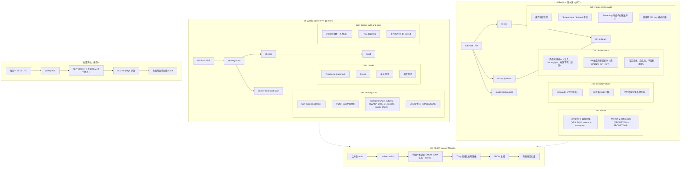

# 7. MLSecOps / LLMSecOps 流水线

## CI / CD 流水线图



### 流水线概述

NaviGo 通过四个 GitHub Actions 工作流（`ci.yml`、`llmsecops.yml`、`cd.yml`、`weekly-quality-eval.yml`）实施多层纵深防御的 CI/CD 流水线。每次 push 或 PR 到 `main` 时：

1. **安全扫描** 是所有下游作业的前置关卡——依赖审计、密钥检测、SAST 和 SBOM 生成必须先行通过。
2. **代码质量检查**（typecheck、lint、单元测试、集成测试）与 Docker 构建 + 漏洞扫描并行运行。
3. **LLM 专属安全** 在独立的并行工作流中运行：AI SAST、AI 供应链审查、红队对抗测试和模型配置审计。
4. **CD** 在合并到 `main` 时触发：构建 Docker 镜像、推送到 GHCR、使用 Trivy 重新扫描、发布 SBOM 和构建来源验证。
5. **每周质量评估** 在每次周一 09:00 UTC 定时运行：使用真实 LLM 执行 3 个代表场景的完整 planner，再通过 LLM-as-judge 对输出质量进行评分，失败时自动创建 GitHub Issue。

---

## 自动化测试（含 AI 安全测试）

### 测试策略矩阵

| 层次 | 范围 | 框架 | 产出 |
|------|------|------|------|
| 类型检查 | 静态类型安全 | `tsc --noEmit` | 零 `any` 泄漏，严格 Zod 推断 |
| Lint | 代码质量、安全反模式 | ESLint flat config + `@typescript-eslint` | 强制一致的模式 |
| 单元测试 | 独立 agent 逻辑、工具、护栏 | Vitest（Node env, globals） | `tests/unit/**/*.test.ts` — 7 个套件 |
| 集成测试 | 完整图流程、HTTP 端点 | Vitest + Fastify inject + 内存 checkpointer | `tests/integration/**/*.test.ts` — 3 个套件 |
| 评估测试 | 端到端完整性评分 | Vitest + LangSmith（有条件） | `tests/evals/travel-planner.eval.ts` — 1 个套件 |
| 质量评估（每周） | LLM-as-judge 内容质量回归 | Vitest + 真实 OpenAI（有条件） | `tests/evals/llm-judge-quality.eval.ts` — 3 个场景 |
| 红队测试 | 对抗性护栏测试 | Vitest + 可选 OpenAI 生成变体 | `tests/redteam/guardrails.redteam.test.ts` — 1 个套件 |

### 单元测试（7 个套件）

每个 agent 节点使用 `FakeStructuredChatModel`（见 `tests/helpers/fake-model.ts`）进行隔离测试——该测试替身将 agent key 映射到预配置的结构化输出，消除真实 LLM 调用。无需 API key。

| 测试文件 | 被测 Agent | 关键场景 |
|----------|-----------|----------|
| `requirement-parser.agent.test.ts` | Requirement Parser | 自然语言解析、已解析时的提前退出、决策日志条目 |
| `form-completer.agent.test.ts` | Form Completer | 完整与不完整表单装配 |
| `itinerary.agent.test.ts` | Itinerary Agent | 正常、未知城市、晚间航班中转日（使用真实 stub 获取天气/航班） |
| `budget.agent.test.ts` | Budget Agent | 成本验证、阈值逻辑、超预算边缘情况 |
| `flight-option-selection.test.ts` | Flight Selection Helper | 按到达时间和价格偏好排序（纯逻辑，无模型） |
| `risk-guard.agent.test.ts` | Risk Guard | 阻断与允许场景 |
| `guardrails.test.ts` | 静态护栏 | Prompt 注入与不安全输出模式检测 |
| `http.test.ts` | HTTP 工具 | 查询参数传递、JSON 解析、超时处理（本地 HTTP 服务器） |

### 集成测试（3 个套件）

使用 `buildPlannerGraph(...)` 构建完整图，配合内存 checkpointer。启动真实 Fastify 服务器进行 HTTP 注入测试。

| 测试文件 | 范围 | 场景 |
|----------|------|------|
| `graph.plan-flow.test.ts` | 完整 planner 图 | 端到端计划生成、跨调用 checkpoint 持久化 |
| `api.chat-endpoint.test.ts` | Chat 端点 | 多轮表单填充流程（awaiting_input -> complete），通过 `POST /plan/chat` 和 `POST /plan/chat/resume` |
| `api.plan-endpoint.test.ts` | 结构化计划端点 | 计划创建、字段验证、响应结构 |
| `api.frontend-route.test.ts` | 静态资源服务 | 前端路由与文件服务 |

### 评估测试

`tests/evals/travel-planner.eval.ts`——条件运行完整 planner 图（需 `LANGSMITH_API_KEY`），对输出完整性进行评分：摘要、行程、打包清单、预算评估。当 key 缺失时回退为跳过解释。

### LLM-as-Judge 质量评估

`tests/evals/llm-judge-quality.eval.ts`——使用真实 LLM 在 3 个代表场景（东京文化之旅、巴黎艺术周末、曼谷经济游）上运行完整 planner，然后使用独立的 LLM 调用对输出质量进行 5 个维度的评分：

| 维度 | 衡量内容 | 最低分 |
|------|---------|--------|
| `itineraryQuality` | 每日主题连贯性、活动适合度、天气整合 | 5 |
| `budgetAccuracy` | 预算估算的合理性、可操作的优化建议 | 5 |
| `packingRelevance` | 与目的地、季节、计划活动的匹配度 | 5 |
| `safetyFlagsAccuracy` | 合理的标识、无明显遗漏的风险 |（参考） |
| `overallCoherence` | 计划整体一致，各部分相互配合 | 6 |

需 `OPENAI_API_KEY`。`DUFFEL_API_TOKEN` 为可选（缺少时航班结果返回空）。作为**每周定时任务**运行（`.github/workflows/weekly-quality-eval.yml`，每周一 09:00 UTC），同时支持手动 `workflow_dispatch`。失败时自动创建 GitHub Issue，包含评分详情和调查步骤。

### AI 安全测试

#### 红队对抗测试（`tests/redteam/guardrails.redteam.test.ts`）

在 CI（`llmsecops.yml`，job `llm-redteam`）中执行，也可本地运行 `npx vitest run tests/redteam/`。

**静态对抗样本**覆盖六类攻击：
- 经典 prompt 注入（`忽略之前的指令`、`揭示 system prompt`）
- Homoglyph 替换（通过 Unicode 字符映射绕过关键词过滤）
- 零宽字符注入
- 结构化载荷间接注入
- 越狱模式（`DAN mode`、`developer mode`）
- 上下文操纵攻击

**LLM 生成的新颖变体**（需 `OPENAI_API_KEY`）：使用攻击者 LLM 生成针对护栏的新颖对抗载荷，衡量基于规则和基于 LLM 的安全层各自的检测率。

**已知盲区**以信息性方式记录，不阻断构建——这防止 CI 因预期的检测缺口而失败，同时持续积累覆盖边界的公开记录。

#### Prompt 安全静态分析（`scripts/prompt-security-scan.ts`）

在 CI（job `ai-sast`）中执行，也可本地运行 `npx tsx scripts/prompt-security-scan.ts`：

| 规则 ID | 严重级别 | 检测内容 |
|---------|----------|----------|
| PROMPT-001 | CRITICAL | 用户输入（`requestText`, `naturalLanguage`, `input`, `message`, `prompt`）直接插值到 LLM `invoke()` 模板字面量，未使用 `JSON.stringify` 或结构化验证 |
| PROMPT-002 | HIGH | 入口点的 LLM `invoke()` 或 `withStructuredOutput()` 未配备可见护栏。`src/agents/` 下的 agent 文件豁免，因为 `risk_guard` 在上游执行检查 |
| PROMPT-003 | MEDIUM | 硬编码 system prompt 包含易被操纵的短语（`You are`, `Act as`, `ignore previous`, `system prompt`, `developer mode`） |
| PROMPT-004 | HIGH | LLM `invoke()` 未使用 `withStructuredOutput` 且后续 20 行内没有 `.parse()`、`safeParse()` 或 `detectUnsafeOutput` 验证 |
| PROMPT-005 | MEDIUM | 安全关键流程中 temperature > 0.3（排除 temperature <= 0.3 的情况） |

CRITICAL 或 HIGH 级别发现会导致构建失败。

#### 模型配置审计（`scripts/model-config-audit.ts`）

在 CI（job `model-config-audit`）中执行，也可本地运行 `npx tsx scripts/model-config-audit.ts`：

- **模型选择**：检测废弃模型（`gpt-3.5-turbo-0301`, `gpt-4-0314`, `text-davinci` 等）
- **Temperature**：标记 temperature > 0.5（HIGH），记录 temperature <= 0.3（INFO）
- **超时**：标记 timeout > 60,000ms 为潜在资源耗尽风险
- **Streaming**：记录 `streaming: true` 为积极安全指标（支持不安全输出的提前终止）
- **结构化输出**：记录 `withStructuredOutput` 为积极安全指标（强制 schema 验证）
- **硬编码密钥**：在 `src/` 和 `scripts/` 中 grep 扫描 OpenAI（`sk-...`, `sk-proj-...`）和 Duffel（`duffel_test_...`, `duffel_live_...`）密钥模式

CRITICAL 或 HIGH 级别发现会导致构建失败。

#### AI 供应链安全（`scripts/ai-dependency-scan.ts`）

在 CI（job `ai-supply-chain`）中执行，也可本地运行 `npx tsx scripts/ai-dependency-scan.ts`：

- 对照 AI/ML 包（`langchain`, `openai`, `@langchain/core`）的精选 CVE 列表扫描 `package-lock.json`
- 检查的公告包括 `CVE-2024-23334`（langchain 路径遍历）、chain 中的 SQL 注入风险、废弃的 OpenAI 版本
- 已知篡改包黑名单检查：`colors`, `faker`, `node-ipc`, `peacenotwar`

---

## 版本控制与追踪

### 语义化版本

NaviGo 遵循语义化版本（`package.json`: `"version": "0.1.0"`）。当前处于 pre-1.0 阶段，表示 API 接口可能发生变化。

### 通过 LangGraph Checkpoint 进行状态版本控制

每次图执行都会在 PostgreSQL 中创建版本化的 checkpoint（通过 `@langchain/langgraph-checkpoint-postgres`）。每个 checkpoint 捕获给定 `thread_id` 的完整 `PlannerState` 快照，支持：

- **多轮对话恢复**：`POST /plan/chat/resume` 读取最近 checkpoint 以继续被中断的对话。
- **状态检查**：`GET /plan/:threadId` 检索任意 thread 的当前计划状态。
- **可复现性**：Checkpoint 支持特定图执行的重放和调试。

### 基于 Thread 的追踪

每个用户会话由 `thread_id` 标识。所有 API 端点接收或返回 `thread_id`，它作为跨以下系统的主要关联键：

- LangGraph checkpoint（Postgres 或内存）
- LangSmith 追踪 spans（`buildTraceMetadata` 注入 `threadId`, `userId`, `scenario`, `service`）
- 决策日志条目（每个 agent 的时间戳审计轨迹）

### 决策日志（审计轨迹）

每个 agent 节点将 `DecisionLogEntry` 写入共享状态的 `decisionLog` 数组。每个条目包含：

```typescript
{
  agent: string;           // 例如 "itinerary_agent", "risk_guard"
  inputSummary: string;    // Agent 接收到的内容
  keyEvidence: string[];   // 参考的数据来源（航班、天气等）
  outputSummary: string;   // Agent 的决策结果
  riskFlags: string[];     // 标记的任何风险
  timestamp: string;       // ISO 8601
}
```

决策日志上限为 100 条（最旧条目被淘汰），防止跨多轮会话无限增长。累积使用 union reducer（`safetyFlags` 使用 `[...new Set([...left, ...right])]`；`decisionLog` 使用追加 + 截断）。

### 安全标识（Safety Flags）

`safetyFlags` 是一个去重数组，累加自所有 agent 节点并合入最终计划。每个标识带有结构化前缀：

- `PROMPT_INJECTION:*` —— 来自基于规则的静态检测
- `BLOCKED_PROMPT_INJECTION` —— 来自基于 LLM 的语义检测（触发阻断）
- `UNSAFE_OUTPUT:*` —— 来自输出内容扫描
- `WEATHER_HIGH_RISK` —— 来自 itinerary agent 的天气评估
- `BUDGET_EXCEEDED` —— 来自 budget agent 的评估

### Docker 镜像版本

CD 使用两个标签向 GHCR 发布镜像：

- `sha-<short>`：不可变，每个 commit 一个，支持精确定位回滚
- `latest`：默认分支的浮动标签，方便部署

### 制品验证

CD 生成构建来源验证（`actions/attest-build-provenance@v2`）并将其与镜像一同推送到 GHCR 注册表，建立源代码 commit 与已发布制品之间的可验证链接。

---

## 部署策略

### 制品

单阶段多阶段 Docker 镜像（`node:20-alpine`）：

```dockerfile
# 构建阶段：npm ci + tsc 编译
FROM node:20-alpine AS builder
COPY package*.json ./
RUN npm ci
COPY . .
RUN npm run build

# 生产阶段：仅依赖，dist + public
FROM node:20-alpine
ENV NODE_ENV=production PORT=3000
COPY package*.json ./
RUN npm ci --omit=dev --ignore-scripts && npm cache clean --force
COPY --from=builder /app/dist ./dist
COPY --from=builder /app/public ./public
EXPOSE 3000
CMD ["node", "dist/index.js"]
```

关键属性：

- 仅安装生产依赖（`--omit=dev`）
- 运行时镜像中不含构建工具
- 最小攻击面（Alpine 基础镜像，单进程）
- 显式 `EXPOSE 3000`

### 基础设施依赖

`docker-compose.yml` 提供 PostgreSQL 后端服务：

```yaml
services:
  postgres:
    image: postgres:16-alpine
    healthcheck:
      test: ["CMD-SHELL", "pg_isready -U postgres -d navi_go"]
    volumes:
      - navi_go_postgres_data:/var/lib/postgresql/data
```

### 目标环境变量

NaviGo 部署为单无状态进程（所有状态通过 LangGraph checkpointer 存储在 PostgreSQL 中）。环境变量控制所有外部依赖：

| 变量 | 是否必需 | 用途 |
|------|----------|------|
| `OPENAI_API_KEY` | 是 | LLM 推理 |
| `OPENAI_MODEL` | 否（默认 `gpt-4o-mini`） | 模型选择 |
| `DUFFEL_API_TOKEN` | 是 | 航班搜索 |
| `DUFFEL_BASE_URL` | 否（默认 Duffel 生产环境） | 航班 API 端点 |
| `POSTGRES_URL` | 是（生产环境） | Checkpoint 持久化 |
| `LANGSMITH_TRACING` | 否（默认 `false`） | 追踪可观测性 |
| `LANGSMITH_API_KEY` | 条件必需 | LangSmith 认证 |
| `LANGSMITH_PROJECT` | 否（默认 `navi-go`） | 追踪项目命名空间 |
| `PORT` | 否（默认 `3000`） | HTTP 监听端口 |

运行时强制：`requireOpenAiApiKey()`、`requireDuffelApiToken()` 和 `requirePostgresUrl()` 在首次使用时才调用（而非启动时），允许应用启动并响应健康检查，即使可选依赖不可用——只有需要它们的特性路径才会抛出异常。

### 部署模式

1. **直接 Node.js**：`npm run build && npm run start`——适用于裸机或 VM 部署。
2. **Docker**：`docker build -t navi-go . && docker run -p 3000:3000 --env-file .env navi-go`——标准容器化部署。
3. **Docker Compose**：`docker compose up -d`——包含 PostgreSQL，适合开发或单机部署。
4. **GHCR 拉取**：`docker pull ghcr.io/<org>/navi-go:latest`——CD 发布的镜像，包含 Trivy 扫描 + SBOM + 构建来源验证。

### 优雅关闭

Fastify 服务器监听 `SIGTERM` 和 `SIGINT`：

```typescript
process.on("SIGTERM", () => void shutdown("SIGTERM"));
process.on("SIGINT", () => void shutdown("SIGINT"));
```

`app.close()` 在进程退出前排空进行中的请求。

### 回滚策略

CD 发布 `sha-<short>` 标签的镜像。回滚即部署之前某个 SHA 标签的镜像。无需数据库迁移（LangGraph 内部处理 checkpoint schema）。

---

## 监控与简报

### 健康检查端点

`GET /health` 返回：

```json
{
  "status": "ok" | "degraded",
  "db": "connected" | "disconnected",
  "uptime": 12345.678
}
```

该端点通过 `graph.getState()` 对合成 `thread_id`（`__health_check__`）执行轻量级数据库连通性探测。`degraded` 状态表示 PostgreSQL 不可达；服务仍可用（非生产场景下回退到内存 checkpointer）。

### LangSmith 可观测性

当 `LANGSMITH_TRACING=true`（`src/observability/tracing.ts`）时：

- **追踪上下文**统一注入：`{ userId, threadId, scenario, service: "navi-go" }`
- **API 入口点追踪**：每个 `POST /plan`、`POST /plan/chat`、`POST /plan/chat/resume` 调用都是一个追踪 span
- **Agent 执行追踪**：LangGraph 的内置追踪展示每个节点调用、状态转换和工具调用

LangSmith 提供：

- 每个 agent 节点的延迟分解
- 每次 LLM 调用的 token 用量追踪
- 每个端点的错误率监控
- 通过 checkpoint 状态的完整重放能力

### 结构化日志

Fastify 内置的 Pino 日志器（`{ logger: true }`）向 stdout 输出结构化 JSON 日志行：

```json
{"level":30,"time":1714512000000,"pid":1234,"hostname":"...","msg":"服务器正在监听 http://0.0.0.0:3000"}
```

所有日志条目包含时间戳、PID、主机名和日志级别。Pino 的结构化格式可直接被日志聚合器使用（Elasticsearch、Loki、CloudWatch 等）。

### 速率限制

`@fastify/rate-limit` 对每个客户端 IP 强制执行**每分钟 100 次请求**，可通过 Fastify 插件选项配置。

### 告警集成点

生产环境监控可使用以下集成点：

- **健康检查端点**用于负载均衡器/编排器探针（Kubernetes liveness/readiness、AWS ALB 健康检查）
- **结构化 JSON 日志**用于基于日志的告警（例如，错误率阈值、响应时间异常）
- **LangSmith 追踪**用于 LLM 专属告警（token 成本峰值、模型错误、护栏命中率）
- **Trivy SARIF 输出**用于漏洞仪表板集成（GitHub Code Scanning、DefectDojo）

---

## 日志与可审计性

### 运行时审计轨迹：决策日志

图中的每个 agent 节点在返回状态前都会写入带时间戳的 `DecisionLogEntry`。这创建了一份逐步记录，包含：

- **Agent 看到的内容**（`inputSummary`）
- **它参考了哪些证据**（`keyEvidence`——航班数据、天气预报、预算约束）
- **它决定了什么**（`outputSummary`）
- **它识别了哪些风险**（`riskFlags`）
- **做出决策的时间**（`timestamp`，ISO 8601）

决策日志持久化在图 checkpoint（PostgreSQL）中，可通过 `GET /plan/:threadId` 访问。这支持：

- **事后事故分析**：精确重建每个 agent 考虑了哪些数据以及得出了什么结论。
- **合规报告**：为每个生成的计划提供结构化审计轨迹。
- **调试**：精确定位哪个 agent 引入了错误或遗漏了风险。

### 安全标识作为安全审计轨迹

`safetyFlags` 是一个去重、累加的数组，记录整个规划流程中每个安全相关事件。每个标识是机器可读的字符串，前缀编码了检测来源和类型。该信息在 API 响应中公开，并嵌入 `FinalPlan.safetyFlags`。

### 图状态 Checkpoint

LangGraph 的 PostgresSaver 在每个节点执行后捕获完整的 `PlannerState`。每个 checkpoint 以 `thread_id` 为键，包含：

- 所有 18 个状态字段（`userRequest`、`preferences`、`flightOptions`、`weatherRisks` 等）
- 完整的 `decisionLog` 和 `safetyFlags` 数组
- 当前图位置（从哪个节点恢复）

这提供：

- **完全重放能力**：Checkpoint 状态可以从任意点加载并重新执行。
- **不可变记录**：先前的 checkpoint 不会被后续执行改变。
- **线程隔离**：每个 `thread_id` 完全隔离。

### API 访问日志

Pino 自动记录每个 HTTP 请求（Fastify 默认），包括：

- 方法、URL、状态码
- 响应时间
- 请求/响应载荷大小

在生产环境中，将这些结构化日志转发到集中式日志聚合系统。

### SBOM 与供应链透明度

每次 CI 和 CD 运行都通过 `anchore/sbom-action` 生成 SPDX 格式的 SBOM（软件物料清单）。SBOM 提供所有依赖的机器可读清单及版本，支持：

- 漏洞影响分析（"哪些服务使用了这个有漏洞的包？"）
- 许可证合规审计
- 构建可复现性验证

### 代码来源验证

CD 发布与 GHCR 镜像 digest 关联的构建来源验证（`actions/attest-build-provenance@v2`）。这提供了以下内容的加密证明：

- 哪个 git commit 生成了镜像
- 哪个工作流和 runner 构建了它
- 完整的构建参数

### 日志/数据脱敏注意事项

**当前状态**：日志或 checkpoint 中没有明确的 PII 脱敏。用户请求和自然语言输入存储在 checkpoint 中，并可能出现在 Pino 请求日志中。

**推荐的加固措施**（尚未实现）：

- 从日志输出中脱敏 `OPENAI_API_KEY`、`DUFFEL_API_TOKEN`（已在环境变量打印中排除，但需验证 Pino 序列化）
- 在生产部署中，在 checkpoint 持久化之前添加 PII 擦除层
- 为 checkpoint 数据添加基于 TTL 的归档策略，以符合数据保留政策

### CI 安全扫描结果

所有安全扫描结果以 GitHub 原生制品形式呈现：

- **Trivy SARIF**：上传到 GitHub Code Scanning，在 Security 选项卡中可见
- **Semgrep 发现**：在 PR annotations 和工作流摘要中展示
- **SBOM**：每次 CI/CD 运行的可下载制品
- **Prompt 安全 / 模型审计 / AI 依赖扫描**：工作流日志中的控制台输出，在发现 CRITICAL/HIGH 级别问题时以非零退出

---

## 本地开发质量门禁

```bash
npm run typecheck        # 静态类型安全
npm run lint             # 代码质量 + 安全反模式
npm run test:unit        # 7 个单元测试套件（无需 API key）
npm run test:integration # 3 个集成测试套件（无需 API key）
npm run test:eval        # 评估评分（需 LANGSMITH_API_KEY）
npm run acceptance       # 完整门禁：typecheck + lint + 所有测试 + live CLI 场景（需 API key）
```

独立安全脚本（可本地运行，无需部署）：

```bash
npx tsx scripts/prompt-security-scan.ts   # 5 规则 prompt 注入 SAST
npx tsx scripts/ai-dependency-scan.ts     # AI/ML CVE + 黑名单检查
npx tsx scripts/model-config-audit.ts     # 模型配置安全审计
npx vitest run tests/redteam/             # 红队对抗测试
npx vitest run tests/evals/llm-judge-quality.eval.ts  # LLM-as-judge 质量评估（需 OPENAI_API_KEY）
```

---

## 建议的下一步增强

- ~~将 `test:eval` 纳入 CI 的必跑或定时任务~~ —— **已完成**：每周 LLM-as-judge 质量评估（`.github/workflows/weekly-quality-eval.yml`）。
- 增加 prompt injection 专用轻量级分类器模型（规则 + LLM + 分类器三层防御）。
- 为 API 加入认证与更细粒度限流策略。
- 为 checkpoint 数据增加生命周期治理（TTL / 归档）。
- 在日志输出和 checkpoint 持久化之前增加 PII 脱敏层。
- 将 red-team 检测率趋势纳入安全看板。
